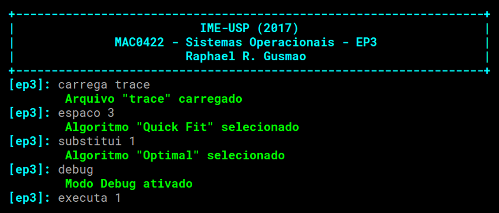
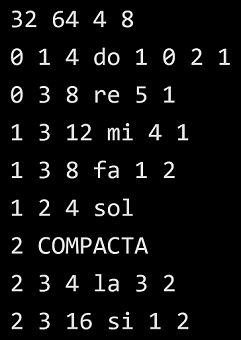
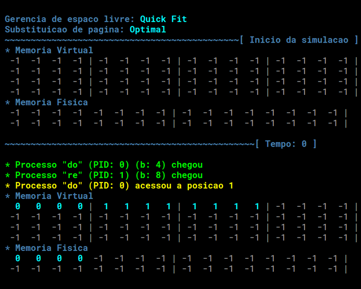
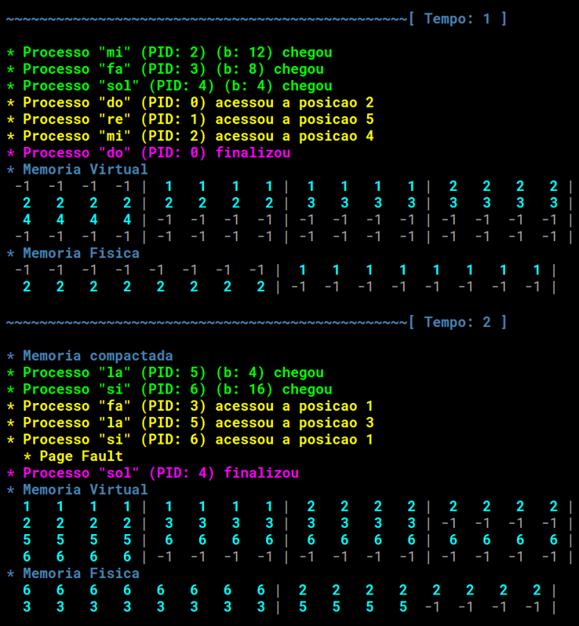
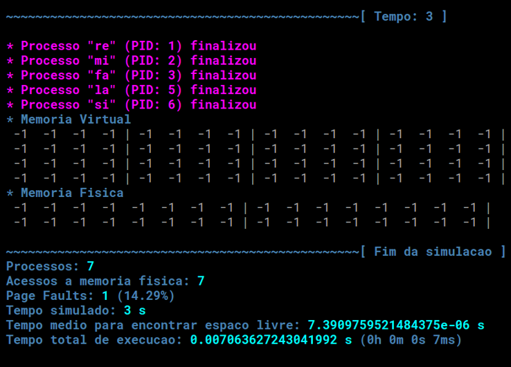

# Memory Managment Simulator
### Simulador de Gerenciamento de Memória
2017 | IME-USP | MAC0422 - Sistemas Operacionais - EP3

O enunciado do programa está no arquivo [ep3.pdf](ep3.pdf).

### Execução
Para executar o programa, abra o terminal na pasta do código fonte e digite:
```
$ python ep3.py
```

### Códigos
Linguagem utilizada: **Python 3**
- [ep3.py](ep3.py)
    - Shell
- [simulator.py](simulator.py)
    - Carrega o arquivo de trace
    - Executa a simulação
- [memory.py](memory.py)
    - Estrutura das memórias física e virtual
    - Gerenciamento de espaço livre
    - Substituição de páginas
- [process.py](process.py)
    - Estrutura do processo
- [tests.py](process.py)
    - Testes de eficiência

### Shell
#### Comandos
- `carrega <arquivo>`
- `espaco <num>`
- `substitui <num>`
- `debug`
- `executa <intervalo>`



#### Debug
O comando `debug` exibe os eventos ocorridos durante a simulação:
- Processos que chegaram
- Processos que acessaram a memória
- Processos que finalizaram
- Memória compactada
- *Page Faults*

Cada evento tem uma coloração específica para facilitar a visualização. Para desativar o modo *Debug*, basta digitar `debug` novamente no *shell*.

#### Arquivo de entrada ([trace](trace))
Detalhes no arquivo [ep3.pdf](ep3.pdf).



### Simulador
#### Ordem dos eventos
- Atualiza o bit R (LRU4)
- Compacta a memória
- Inicia processos
- Processos acessam a memória
- Finaliza processos
- Exibe as memórias

Cada loop = 1 segundo.





### Memória
#### Estruturas
- Mantém uma lista ligada para a **memória virtual** em que cada nó tem:
    - `pid`: Identificador do processo que está naquela posição (ou -1)
    - `base`: Primeiro endereço do nó
    - `size`: Quantidade de endereços do nó
- Mantém outra lista ligada para a **memória física** em que cada nó é uma página com os seguintes atributos:
    - `page_id`: Identificador da página
    - `pid`: Identificador do processo que está naquela posição (ou -1)
    - `b`: Tamanho da parte do processo que está na página
    - `part`: Parte do processo que está na página
    - `counter`: Contador para o algoritmo LRU4
    - `label`: Rótulo para o algoritmo Optimal (tempo que a página será acessada novamente (ou -1))

#### Algoritmos
- Os algoritmos de **gerenciamento de espaço livre** são métodos da classe `Memory` e são chamados pelo método `allocate()`, que, após receber o nó da posição livre devolvido pelos algoritmos, cria naquela posição um outro nó para o novo processo.
- Os algoritmos de **substituição de página** também são métodos da classe `Memory` e são chamados pelo método `access()`, que, após receber a página escolhida pelos algoritmos, altera o conteúdo da página para que ela passe a pertencer à parte correspondente do processo.

### Processo
#### Atributos
- `pid`: Identificador
- `t0`: Momento que ele chega no sistema
- `tf`: Momento que ele é finalizado
- `b`: Quantidade de memória utilizada
- `name`: Nome
- `accesses`: Vetor de acessos à memoria feitos por ele
- `memo`: Referência ao gerenciador de memória utilizado

#### Métodos
- `begin()`: Inicia o processo (aloca um espaço na memória virtual)
- `memory_access()`: Acessa uma posição na memória física
- `finish()`: Finaliza o processo (remove o processo das memórias)
